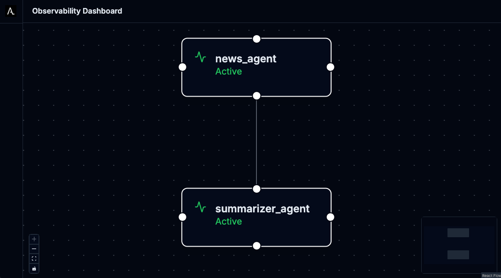

# Agentic AI News Showcase

This showcase demonstrates multi-agent AI communication using the Agentic Layer platform.

Find out more about the Agentic Layer on our [landing page](http://agentic-layer.ai/) and in
our [documentation](https://docs.agentic-layer.ai/).

---

## Getting Started

For detailed setup instructions and a step-by-step tutorial, see our comprehensive guide:

**📖 [News Showcase Tutorial](https://docs.agentic-layer.ai/home/main/tutorials/showcase-news.html)**

### Quick Start

If you have Docker, kubectl, and Tilt installed:

1. Clone this repo and set your `GOOGLE_API_KEY` environment variable
2. Point kubectl to a local Kubernetes cluster
3. Run `tilt up` and wait for all components to start

For additional tools, try the [a2a-inspector](https://github.com/a2aproject/a2a-inspector) for GUI-based agent
interaction. 
