# Agentic Layer Demo

The Agentic Layer is a collection of open-source tools and Kubernetes operators for the operation of vendor-agnostic AI platforms.

Find out more about the Agentic Layer on our [landing page](http://agentic-layer.ai/) or our [documentation](https://docs.agentic-layer.ai/).


--- 
The Agentic Layer Demo showcases the following:

- Example AI usecase:
  - Multiple Agents communicate via the A2A protocol
  - An agent uses an MCP tool
- Agentic Layer components:
  - [Agentic Layer SDK](https://github.com/agentic-layer/sdk-python) (adds tracing support to Google ADK) 
  - [Observability Dashboard](https://github.com/agentic-layer/observability-dashboard/) used to visualize agent-to-agent communication).

## Overview

### What happens in our demo?

```mermaid
  graph LR
    User[👤 User]
NewsAgent[📰 News Agent]
SummarizerAgent[📝 Summarizer Agent]
MCPServer[🔧 News MCP Server]

%% User interactions
User -->|'What's new in AI?'| NewsAgent
User -->|'Summarize that article'| NewsAgent

%% News Agent to MCP Server
NewsAgent -->|Tool Call:<br>Fetch Articles| MCPServer


%% News Agent to Summarizer Agent
NewsAgent -->|Agent Task:<br>Summarize URL| SummarizerAgent
SummarizerAgent -->|GET| Internet[🌐 Internet]


%% MCP Server RSS Sources
MCPServer -->|fetch| RSSFeeds[📡 RSS Feeds]


%% Styling
classDef userClass fill:#e1f5fe
classDef agentClass fill:#f3e5f5
classDef mcpClass fill:#e8f5e8
classDef externalClass fill:#fff3e0

class User userClass
class NewsAgent,SummarizerAgent agentClass
class MCPServer mcpClass
class Internet,RSSFeeds externalClass
```




This is the flow:
- User asks the News Agent questions like "What's new in AI?" or "Summarize that article"
- News Agent fetches latest articles using the News MCP Server (which aggregates RSS feeds from OpenAI, AI News, VentureBeat, etc.)
- For summarization requests, News Agent delegates to the Summarizer Agent via A2A protocol
- Summarizer Agent scrapes article content from the web and generates concise summaries
- All agent interactions are traced and visualized through the Observability Dashboard

### What happens under the hood?

- We use the [Agentic Layer SDK](https://github.com/agentic-layer/sdk-python)'s `to_a2a` method to
  - provide some default configurations for our agents
  - instrument the agent executors with a custom tracing plugin
- The tracing plugin forwards traces to an OpenTelemetry Collector endpoint.
- The [observability dashboard](https://github.com/agentic-layer/observability-dashboard/) listens to these traces in realtime, enabling live debugging.


## Setup

### Prerequisites

This demo assumes you have the following:

- Installed Software
  - Docker (configured to use up to 8GB)
  - kubectl
  - [Tilt](https://tilt.dev/)
- Access to Gemini:
  - You will need a [Gemini API key](https://ai.google.dev/gemini-api/docs/api-key).
- Access to a Kubernetes cluster
  - We recommend using a local cluster, e.g. created via [kind](https://kind.sigs.k8s.io/), [k3s](https://k3s.io/) or [k3d](https://k3d.io/)
  - If using a non-local Kubernetes cluster, you will need to allow Tilt to use your context (see the [Tilt docs](https://docs.tilt.dev/api.html#api.allow_k8s_contexts))

### Instructions

1. Clone this repo
1. Set the environment variable `GOOGLE_API_KEY` to your Gemini API key
1. Set your kube context to point to a local Kubernetes cluster.
1. Start Tilt
    ```shell
    tilt up
    ```
1. Wait for all applications to start
1. Open the Observability Dashboard 
   - exposed at http://localhost:10005
1. Prompt the host agent to talk to the other agent via A2A.
   - Either:
     1. via cURL (recommended):
       ```shell
       curl http://localhost:8000/ \
       -H "Content-Type: application/json" \
       -d '{
         "jsonrpc": "2.0",
         "id": 1,
         "method": "message/send",
         "params": {
           "message": {
             "role": "agent",
             "parts": [
               {
                 "kind": "text",
                 "text": "Please summarize this blog post: https://blog.qaware.de/posts/deepquali/"
               }
             ],
             "messageId": "9229e770-767c-417b-a0b0-f0741243c579",
             "contextId": "abcd1234-5678-90ab-cdef-1234567890ad"
           },
           "metadata": {}
         }
       }' | jq
       ```
     1. OR from a GUI tool like the [a2a-inspector](https://github.com/a2aproject/a2a-inspector)
1. Inspect the communication of the agents 


