# Agentic Layer Showcase for a News-Agent

The Agentic Layer is a collection of open-source tools and Kubernetes operators for the operation of vendor-agnostic AI
platforms.

Find out more about the Agentic Layer on our [landing page](http://agentic-layer.ai/) or
our [documentation](https://docs.agentic-layer.ai/).


--- 
The Agentic Layer Demo showcases the following:

- Example AI usecase:
    - Multiple Agents communicate via the A2A protocol
    - Agents use an MCP tool
- Agentic Layer components:
    - [Agentic Layer SDK](https://github.com/agentic-layer/sdk-python) (adds tracing support to Google ADK)
    - [Observability Dashboard](https://github.com/agentic-layer/observability-dashboard/) (used to visualize
      agent-to-agent communication).

## Overview

### What happens in our demo?

```mermaid
graph LR
    User["👤 User"]
    NewsAgent["📰 News Agent"]
    SummarizerAgent["📝 Summarizer Agent"]
    MCPServer["🔧 News MCP Server"]
    
    User -->|'1. What's new in AI?'|NewsAgent
    NewsAgent -->|2 . Tool Call:<br>Fetch Articles|MCPServer
    MCPServer -->|3 . fetch|RSSFeeds["📡 RSS Feeds"]
    User -->|'4 . Summarize the first article'|NewsAgent
    NewsAgent -->|5 . Agent Task:<br>Summarize URL|SummarizerAgent
    SummarizerAgent -->|6. Tool Call:<br>Fetch Articles|MCPServer
    MCPServer -->|7 . GET|Internet["🌐 Internet"]

%% Styling
classDef userClass fill: #e1f5fe
classDef agentClass fill: #f3e5f5
classDef mcpClass fill: #e8f5e8
classDef externalClass fill: #fff3e0

class User userClass
class NewsAgent agentClass
class SummarizerAgent agentClass
class MCPServer mcpClass
class Internet externalClass
class RSSFeeds externalClass
```



- User asks the News-Agent questions like "What's new in AI?" or "Summarize that article"
- News-Agent fetches latest articles using the News MCP Server (which aggregates RSS feeds from OpenAI, AI News,
  VentureBeat, etc.)
- For summarization requests, News-Agent delegates to the Summarizer Agent via A2A protocol
- Summarizer Agent scrapes article content from the web and generates concise summaries
- All agent interactions are traced and visualized through the Observability Dashboard

### What happens under the hood?

- We use the [Agentic Layer SDK](https://github.com/agentic-layer/sdk-python)'s `to_a2a` method to
    - provide some default configurations for our agents
    - instrument the agent executors with a custom tracing plugin
- The tracing plugin forwards traces to an OpenTelemetry Collector endpoint.
- The [observability dashboard](https://github.com/agentic-layer/observability-dashboard/) listens to these traces in
  realtime, enabling live debugging.

## Setup

### Prerequisites

This showcase assumes you have the following:

- Installed Software
    - Docker (configured to use up to 8GB)
    - kubectl
    - [Tilt](https://tilt.dev/)
- Access to Gemini:
    - You will need a [Gemini API key](https://ai.google.dev/gemini-api/docs/api-key).
- Access to a Kubernetes cluster
    - We recommend using a local cluster, e.g. from Docker Desktop, Rancher Desktop,
      with [kind](https://kind.sigs.k8s.io/), [k3s](https://k3s.io/)
      or [k3d](https://k3d.io/)

### Instructions

1. Clone this repo
1. Set the environment variable `GOOGLE_API_KEY` to your Gemini API key
1. Set your kube context to point to a local Kubernetes cluster.
1. Start Tilt
    ```shell
    tilt up
    ```
1. Wait for all applications to start
1. Open the Observability Dashboard
    - exposed at http://localhost:8100
1. Prompt the news-agent to talk to the other agent via A2A.
    ```shell
    curl http://localhost:8001/ \
    -H "Content-Type: application/json" \
    -d '{
      "jsonrpc": "2.0",
      "id": 1,
      "method": "message/send",
      "params": {
        "message": {
          "role": "user",
          "parts": [
            {
              "kind": "text",
              "text": "What''s the latest news in AI? Summarize the top article to me."
            }
          ],
          "messageId": "9229e770-767c-417b-a0b0-f0741243c579",
          "contextId": "abcd1234-5678-90ab-cdef-1234567890a0"
        },
        "metadata": {}
      }
    }' | jq
    ```
2. Prompt the summarizer-agent to summarize a specified blog post
    ```shell
    curl http://localhost:8002/ \
    -H "Content-Type: application/json" \
    -d '{
      "jsonrpc": "2.0",
      "id": 1,
      "method": "message/send",
      "params": {
        "message": {
          "role": "user",
          "parts": [
            {
              "kind": "text",
              "text": "Please summarize this blog post: https://blog.qaware.de/posts/deepquali/"
            }
          ],
          "messageId": "9229e770-767c-417b-a0b0-f0741243c579",
          "contextId": "abcd1234-5678-90ab-cdef-1234567890ad"
        },
        "metadata": {}
      }
    }' | jq
    ```

You can also use a GUI tool like the [a2a-inspector](https://github.com/a2aproject/a2a-inspector). 
